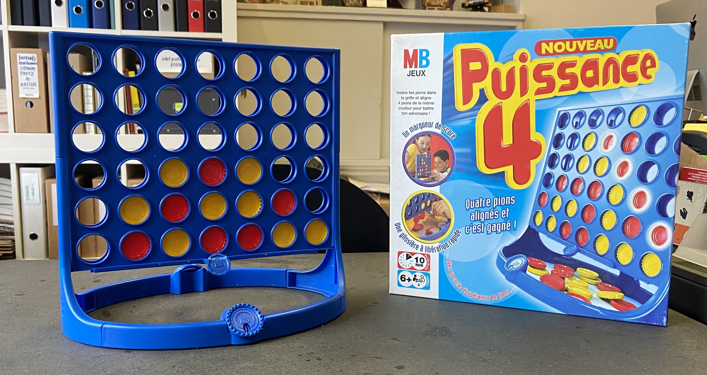
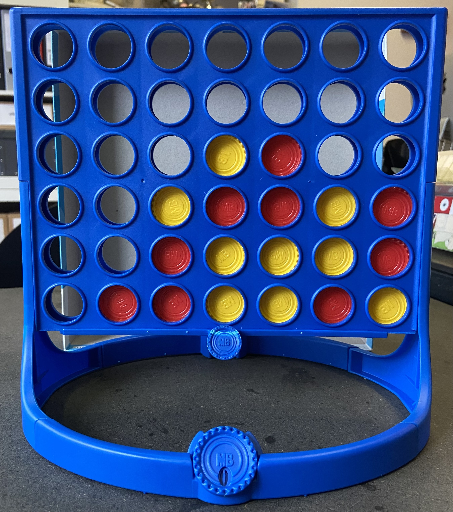
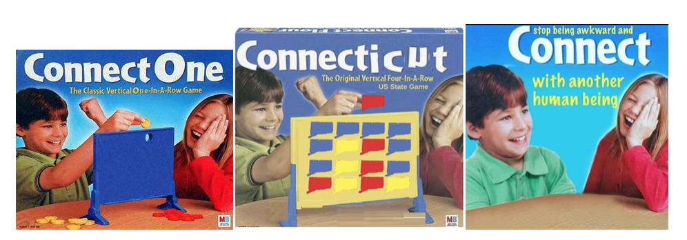
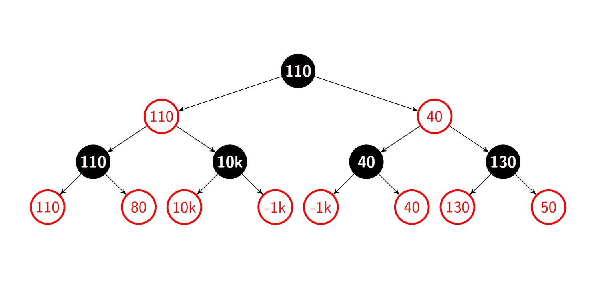

```{r include=FALSE}
library(reticulate)
```

## Partie 1 : Historique du jeu, règles



### Introduction

Le **Puissance 4** (aussi connu sous le nom de **4 en ligne**, en anglais **Connect Four**, **Four in a row**, entre autres) est un jeu de stratégie à information parfaite à deux joueur·euse·s jouant sur un plan vertical. Sa forme actuelle est commercialisée pour la première fois par la Milton Bradley Company en 1974, et il a connu de nombreuses variations depuis.

Le jeu est résolu pour la première fois par James Dow Allen le 1er octobre 1988, et une seconde fois le 16 octobre 1988, indépendamment de la première, par Victor Allis. La personne qui joue en premier peut s’assurer une victoire en commençant dans la colonne centrale. La personne jouant en deuxième peut assurer une partie nulle si son adversaire joue dans les deux colonnes adjacentes à la centrale, et une victoire si le premier jeton est déposé dans l’une des quatre colonnes extérieures.

### Règles 

Le jeu voit s’opposer deux personnes face à face devant une grille verticale de 6 rangées par 7 colonnes. Au début de la partie, chacun·e reçoit 21 jetons d’une couleur, traditionnellement rouge et jaune. Tour à tour, ils·elles déposent un jeton dans la colonne de leur choix, qui tombera jusqu’à la rangée la plus basse disponible. Le but du jeu est d’être la·le premier·ère à aligner 4 jetons de sa couleur, que ce soit verticalement, horizontalement ou en diagonale. Si aucun·e des deux adversaires n’arrive à aligner quatre de ses pions alors que les 42 cases ont été remplies, la partie est nulle.



### Histoire & contexte de création

#### Légendes & autres versions 

Une légende populaire concernant le Puissance 4 concerne le navigateur britannique James Cook (1728-1779). La légende raconte qu’il adorait jouer à un jeu similaire au Puissance 4 dans la cabine de son navire. Il y restait enfermé si longtemps que son équipage surnommait le jeu The Captain’s Mistress, un surnom qui est encore donné au jeu aujourd’hui, bien que la véracité de cette anecdote n’ait jamais été confirmée [@masters_history_nodate].

Le seul jeu similaire au nôtre ayant une existence attestée avant la parution du Puissance 4 est le Score Four, commercialisé pour la première fois en 1968 par Funtastic. Le but est le même, mais il se joue en 3D, sur une grille de 4x4 dotée de tiges sur lesquels enfiler des perles en bois. Il est donc possible de gagner en alignant 4 perles dans toutes les directions possibles. Ce jeu lui-même était inspiré d’un brevet pour un morpion en 3D, déposé en 1946 par Theodore R. Duncan [@masters_history_nodate]. Ainsi, si le Puissance 4 est le premier jeu à faire usage d’un plan vertical en 2D, il n’est pas le premier à utiliser la gravité comme mécanique de jeu, même si Howard Wexler ne cite pas ces jeux comme inspiration.

#### Howard Wexler & la création de la version actuelle

Howard Wexler est l’inventeur du Puissance 4 tel que nous le connaissons aujourd’hui. Après une enfance difficile à New York, ponctuée par des difficultés d’apprentissage dues à sa dyslexie, il obtient une licence en psychologie et pédagogie en suivant les cours du soir au City College de New York. À la fin des années 60, après 10 ans de carrière en tant que psychologue social, enseignant et travailleur social, il se lance dans un doctorat en pédagogie à l’Université de Fordham à New York, qu’il obtiendra en 1970. Pendant ses recherches, il tombe en 1969, sur un article sur la psychologie des jeux, qui éveille  l’invention de jeux [@stellabotte_toy_nodate]. 

Il travaille pendant quelques mois à Pressman Toys et y invente 3 jeux, mais, étant le seul membre de l’équipe créative de l’entreprise et souhaitant en apprendre plus sur l’industrie des jeux, il démissionne en 1970 pour rejoindre Hasbro, une bien plus grande entreprise, vantant son doctorat pour obtenir un emploi. Il y travaille pendant deux ans au sein de l’équipe marketing, passant en revue et sélectionnant les jeux proposés par les inventeur·trice·s et leurs représentant·e·s [@wexler_working_nodate].


En 1972, Wexler quitte Hasbro pour se consacrer pleinement à l’invention de jeux, se fixant l’objectif d’inventer le meilleur jeu de stratégie du monde. Après une longue période sans idée convaincante, c’est en 1973 qu’il se rend compte que tous les jeux de stratégie se jouent sur un plan horizontal, et il lui vient l’idée d’un jeu sur un plan vertical. Le Puissance 4 est né [@wexler_inventing_nodate]. Il commence par utiliser des tubes transparents et des balles de ping-pong pour établir un premier prototype, qu’il perfectionne jusqu’à atteindre la grille de 6x7 que nous connaissons aujourd’hui [@stellabotte_toy_nodate].

Wexler peine à convaincre les entreprises à licencier son jeu. Il le montre en premier à la compagnie Milton Bradley, qui refuse. Après avoir présenté son invention à neuf compagnies, qui refusent toutes, il retourne à nouveau vers Milton Bradley, qui cède. En 1974, le Puissance 4 est commercialisé [@stellabotte_toy_nodate].

### Diffusion 

#### Succès 

Le jeu connaît des débuts difficiles. Il n’apparaît qu’au dos du catalogue Milton Bradley, classifié comme un *jeu de dames vertical*. Cependant, par du bouche à oreille, il connaît une popularité croissante dès 1978, et, en 1981 une publicité télévisée lancée par la Milton Bradley propulse le jeu au rang de classique [@stellabotte_toy_nodate]. 

[fig.4: Pub télévisée (1981) qui a fait le succès du jeu. Cliquer pour voir la vidéo sur youtube](https://www.youtube.com/watch?v=KN3nohBw_CE)

#### Âges 

En créant le jeu, Wexler visait les enfants dès 7 ans, mais il se rend vite compte que le jeu séduit aussi les plus jeunes, qui ne pensent pas forcément à la stratégie, mais qui apprécient la mécanique du jeu (faire tomber les jetons, libérer tous les jetons à la fin de la partie). Par ailleurs, le jeu séduit aussi les plus âgé·e·s. Wexler reçoit notamment des lettres de docteur·esse·s, qui lui racontent que leurs patient·e·s seniors adorent jouer au jeu pour rester agiles d’esprit[@stellabotte_toy_nodate]. 

#### Variations

Le Puissance 4 continue d’être un produit phare de la collection Hasbro, qui a racheté la Milton Bradley en 1984 et qui a continué à faire évoluer le jeu. Outre le changement de couleur, la grille et les jetons passant respectivement du jaune au bleu et du rouge/noir au rouge/jaune, le jeu a connu de nombreuses adaptations et variations, avec des dimensions de grille différentes, des règles différentes, ou des nouveaux concepts.

Concernant les variations, on citera par exemple le *Connect Four Advance*, qui reprend le concept du Score Four, le *Connect Five*, où l’objectif est d’aligner 5 jetons en utilisant des jetons déjà placés dans des colonnes qui viennent se fixer aux extrémités de la grille traditionnelle. Le *Pop Out* est une autre variation qui utilise une nouvelle mécanique de jeu: la Pop Out bar, qui permet de retirer un jeton de la dernière rangée; le jeu se joue comme d’habitude, mais à chaque tour, le·a joueur·euse a le choix soit de placer un jeton, soit d’en retirer un de la dernière rangée, bousculant la grille et créant de nouveaux arrangements. Finalement, le *Power Up* utilise le mécanisme de la Pop Out Bar et ajoute des jetons aux capacités particulières. Par exemple, l’enclume permet de retirer tous les jetons d’une colonne choisie, et le x2 permet de jouer deux jetons dans le même tour [@noauthor_connect_2009].

En plus des différentes variations développées par Hasbro, le jeu a aussi été adapté à différents contextes. Avec l’émergences des ordinateurs, le jeu a été adapté sur ces nouvelles plateformes. La première adaptation sur console date de 1979, et permettait de jouer face à un·e adversaire ou face à l’ordinateur [@noauthor_connect_nodate]. Le jeu est aussi assez présent sur le web, permettant à deux joueur·euses ayant une connexion internet de jouer facilement l’un·e contre l’autre ou seul contre un ordinateur. Par ailleurs, on trouve aussi des versions géantes, pour jouer en extérieur, des adaptations en jeu d’arcade, et bien d’autres variations, officielles ou faites maison. 

#### Dans la culture populaire

En plus de son succès en tant que jeu, le Puissance 4 a aussi connu un certain succès dans la culture populaire, sur le web particulièrement. Un meme connu dérivé du jeu consiste à détourner une image de la boîte du jeu pour en faire des nouveaux jeux absurdes. Bien que le premier meme de ce type semble remonter à 2007 avec le *Connect One*, sa popularité fut au plus haut entre 2016 et 2018, s’étant tassé depuis [@contributeurtrices_a_knowyourmeme_connect_nodate].


### Situation par rapport à d’autres jeux 

Le jeu fait partie de la famille large des jeux à stratégie combinatoire abstrait, soit un jeu qui voit s’opposer deux personnes qui jouent à tour de rôle, dont toutes les informations sont connues par les deux adversaires en tout temps, sans intervention du hasard. On peut donc associer le Puissance 4 aux échecs, au dames, au jeu de go, pour citer quelques exemples.

Par ailleurs, le but du jeu fait bien évidemment penser au morpion (tic-tac-toe), et à tous les jeux utilisant la même prémisse comme but du jeu, soit d’aligner un certain nombre de jetons/pions de sa couleur sur une grille d’une taille définie.

Cependant, d’après nos recherches, il semble bien que le Puissance 4 soit le seul (ou en tout cas, le plus connu), qui fasse usage d’un plan vertical en 2D et de la gravité. Le Puissance 4 fait donc partie d’une grande famille de jeux, mais l’usage de cette contrainte particulière en fait un jeu unique et qui se démarque de ses jeux analogues. 

## Partie 2 : Mathématiques du jeu

### Schématisation :

Un jeu de puissance 4 peut être aisément représenté par une matrice 6x7 comme suit [@noauthor_connect-4_nodate]:

<center>
$\begin{matrix}
     & a & b & c & d & e & f & g\\
\end{matrix}$

$\begin{matrix}
    6\\
    5\\
    4\\
    3\\
    2\\
    1
\end{matrix}$
$\begin{pmatrix}
    o & o & o & o & o & o & o\\
    o & o & o & o & o & o & o\\
    o & o & o & o & o & o & o\\
    o & o & o & o & o & o & o\\
    o & o & o & o & o & o & o\\
    o & o & o & o & o & o & o
\end{pmatrix}$

*fig.6*

</center>

Cette matrice est ensuite remplie par les deux personnes participant à la partie. Dans les exemples qui suivront, nous schématiserons les pions jaunes par des 1 et les rouges par des 2 et partirons toujours du principe que les pions jaunes commencent. Il est toutefois nécessaire de conserver en tête l’aspect de chute des pions car cette visualisation pourrait sous-entendre qu’une situation telle que représentée à la fig.7 est possible, alors qu'elle ne l’est évidemment pas.

<center>
$\begin{matrix}
     & a & b & c & d & e & f & g\\
\end{matrix}$

$\begin{matrix}
    6\\
    5\\
    4\\
    3\\
    2\\
    1
\end{matrix}$
$\begin{pmatrix}
    o & o & o & o & o & o & o\\
    o & o & o & o & 1 & 2 & o\\
    1 & o & o & o & o & o & o\\
    2 & o & o & 2 & o & 1 & o\\
    o & 2 & o & 1 & o & o & o\\
    o & 1 & o & 1 & 2 & o & o
\end{pmatrix}$

*fig.7*

</center>

Si une matrice peut mathématiquement tout à fait avoir cette forme, la représentation schématique de notre jeu ne peut pas l’avoir. En effet, de nombreuses cases de la grille *fig.7* sont vides alors que des pions sont placés au-dessus de ces dernières.

### Stratégies gagnantes:

Avant toute chose, notons qu’il existe 121 combinaisons offrant la victoire et qu'elles peuvent être de 3 formes différentes : verticales, horizontales, ou obliques. Nous allons rapidement les calculer. Les 3 combinaisons verticales par colonne offrant ladite victoire sont les suivantes:

<center>
    $\begin{pmatrix}
  o\\
  o\\
  1\\
  1\\
  1\\
  1\\
\end{pmatrix}$
    $\begin{pmatrix}
  o\\
  1\\
  1\\
  1\\
  1\\
  2\\
\end{pmatrix}$
    $\begin{pmatrix}
  1\\
  1\\
  1\\
  1\\
  2\\
  x\\
\end{pmatrix}$

*fig.8*

</center>

Il suffit maintenant de multiplier ces 3 possibilités par le nombre de colonnes, soit 7, et nous obtenons un total de 21 combinaisons de victoire en colonne.(Le x présent dans la *fig.8* représente un 1 ou un 2, mais en aucun cas un o)
Les combinaisons en lignes sont bien plus nombreuses puisque ces dernières possèdent un élément de plus chacune par rapport aux colonnes et que leur complétion est moins soumise à la gravité. Nous entendons par là que, contrairement à leurs homologues verticales, les combinaisons horizontales peuvent être complétées en leur sein même et n'ont pas forcément une construction graduelle. Elles peuvent donc comporter un total de pions d'une même couleur supérieur à 4. Un pion peut, par exemple, venir relier deux suites de 3 pions et créer alors une seule suite de 7 pions. Ces combinaisons sont donc 10 par ligne et sont les suivantes:

<center>
    $\begin{pmatrix}
1 & 1 & 1 & 1 & x & x & x
\end{pmatrix}$
    $\begin{pmatrix}
x & 1 & 1 & 1 & 1 & x & x
\end{pmatrix}$
    $\begin{pmatrix}
x & x & 1 & 1 & 1 & 1 & x
\end{pmatrix}$
$\begin{pmatrix}
x & x & x & 1 & 1 & 1 & 1
\end{pmatrix}$
$\begin{pmatrix}
1 & 1 & 1 & 1 & 1 & x & x
\end{pmatrix}$
$\begin{pmatrix}
x & 1 & 1 & 1 & 1 & 1 & x
\end{pmatrix}$
$\begin{pmatrix}
x & x & 1 & 1 & 1 & 1 & 1
\end{pmatrix}$
$\begin{pmatrix}
1 & 1 & 1 & 1 & 1 & 1 & x
\end{pmatrix}$
$\begin{pmatrix}
x & 1 & 1 & 1 & 1 & 1 & 1
\end{pmatrix}$
$\begin{pmatrix}
1 & 1 & 1 & 1 & 1 & 1 & 1
\end{pmatrix}$

*fig.9*

</center>

Ces 10 combinaisons multipliées par les 6 lignes composants notre matrice, donne un total de 60 combinaisons gagnantes en ligne. Les x présents dans la *fig.9* représente un 2 ou un o, dépendant du contexte de la partie alors en cours.
Enfin, les combinaisons obliques sont un peu plus délicates à calculer. Il y a toutefois une façon abordable de le faire. Notre matrice 6x7 et composée, de gauche à droite *fig.10*, de 6 obliques différentes possédant au moins 4 cases et d’autant de droite à gauche *fig.11*. Chacune de ces douze obliques permet donc au moins une combinaison gagnante. (Les y n'indiquent pas de valeur mais la position des obliques dont nous parlerons plus loin).

<center>
    $\begin{pmatrix}
    o & o & o & y & y & y & y\\
    o & o & y & y & y & y & y\\
    o & y & y & y & y & y & y\\
    y & y & y & y & y & y & o\\
    y & y & y & y & y & o & o\\
    y & y & y & y & o & o & o
\end{pmatrix}$
    $\begin{pmatrix}
    y & y & y & y & o & o & o\\
    y & y & y & y & y & o & o\\
    y & y & y & y & y & y & o\\
    o & y & y & y & y & y & y\\
    o & o & y & y & y & y & y\\
    o & o & o & x & y & y & y
\end{pmatrix}$

*fig.10* et *fig.11*

</center>

Transformons maintenant ces 12 obliques uniques en lignes afin de les représenter plus aisément et séparons-les en trois groupes. Le premier groupe contient les obliques (désormais lignes) de 4 cases. Ces lignes ne possédant qu’une seule configuration gagnante *fig.12*, nous pouvons passer au groupe suivant.

<center>
    $\begin{pmatrix}
   1 & 1 & 1 & 1
\end{pmatrix}$

*fig.12*

</center>

Le second groupe est composé des 4 obliques (désormais lignes) possédant 5 cases. Elles proposent alors 3 solutions gagnantes différentes (où les x représentent indépendamment  des o ou des 2).

<center>
    $\begin{pmatrix}
   1 & 1 & 1 & 1 & x
\end{pmatrix}$
$\begin{pmatrix}
   x & 1 & 1 & 1 & 1
\end{pmatrix}$
$\begin{pmatrix}
   1 & 1 & 1 & 1 & 1
\end{pmatrix}$

*fig.13*

</center>

Enfin, le troisième et dernier groupe de 4 obliques regroupes celles possédants 6 cases, soit autant que les colonnes.  Nos obliques possèdent toutefois davantage de solutions gagnantes puisqu'elles sont interprétables comme des lignes plutôt que des colonnes. Les 6 alignements amenant une victoire sont donc (où x représente o ou 2):

<center>
    $\begin{pmatrix}
   1 & 1 & 1 & 1 & x & x
\end{pmatrix}$
$\begin{pmatrix}
   x & 1 & 1 & 1 & 1 & x
\end{pmatrix}$
$\begin{pmatrix}
   x & x & 1 & 1 & 1 & 1
\end{pmatrix}$
$\begin{pmatrix}
   1 & 1 & 1 & 1 & 1 & x
\end{pmatrix}$
$\begin{pmatrix}
   x & 1 & 1 & 1 & 1 & 1
\end{pmatrix}$
$\begin{pmatrix}
   1 & 1 & 1 & 1 & 1 & 1
\end{pmatrix}$

*fig.14*

</center>

Une fois toutes ces combinaisons additionnées, nous obtenons un total de 121 combinaisons gagnantes possibles et parmi toutes ces combinaisons, 103 passent par la colonne centrale.
À propos de cette colonne centrale maintenant: en ignorant les erreurs commises par les deux personnes jouant la partie et en partant du principe que chacune d’entre elles joue parfaitement, le résultat de la partie est prévisible dès le premier coup. On peut illustrer ce résultat de la façon suivante:

<center>

$\begin{matrix}
     & a & b & c & d & e & f & g\\
\end{matrix}$

$\begin{matrix}
    6\\
    5\\
    4\\
    3\\
    2\\
    1
\end{matrix}$
$\begin{pmatrix}
    o & o & o & o & o & o & o\\
    o & o & o & o & o & o & o\\
    o & o & o & o & o & o & o\\
    o & o & o & o & o & o & o\\
    o & o & o & o & o & o & o\\
    1 & 1 & 1 & 1 & 1 & 1 & 1
\end{pmatrix}$

$\begin{matrix}
     & l & l & d & w & d & l & l\\
\end{matrix}$

*fig.15*

</center>

Chacun des 1 représente un pion sur une grille vide et un premier coup potentiel. La lettre associée de la matrice 
$\begin{pmatrix}
   l & l & d & w & d & l & l\\
\end{pmatrix}$
donne le résultat attendu en fin de partie, qu'il s'agisse d'une victoire "w", d'une égalité "d" ou d'une défaite "l" pour la personne ayant joué le premier pion.
Si la colonne centrale d est la seule à offrir une victoire assurée dans le cas d’une maîtrise parfaite du jeu, elle est également celle qui offre le plus de possibilités de victoire à une personnes faillible puisque 103 des 121 combinaisons de victoire possibles passent par la colonne centrale. En prendre le contrôle au maximum est donc d’une grande aide.
Si l’une des deux personnes néglige l’importance de la colonne centrale, elle risque de rapidement se retrouver dans une situation dite en 7 de par la forme que prennent les pions une fois cette formation en place [@allen_complete_2010]. Une suite de coups représentant cette erreur suivie de la mise en place d’une disposition en 7 pourrait être la suivante:

<center>

\hspace{15mm}$\begin{matrix}
 & J & R\\
 1 & d1 & d2\\
 2 & d3 & a1\\
 3 & d4 & e1\\
 4 & e2 & d5\\
 5 & e3 & e4\\
 6 & g1 & e5\\
 7 & f1 & f2
\end{matrix}$

*fig.16*

</center>

Cette suite de coups donnerait la grille suivante:

<center>
$\begin{matrix}
     & a & b & c & d & e & f & g\\
\end{matrix}$

$\begin{matrix}
    6\\
    5\\
    4\\
    3\\
    2\\
    1
\end{matrix}$
$\begin{pmatrix}
    o & o & o & o & o & o & o\\
    o & o & o & 2 & 2 & o & o\\
    o & o & o & 1 & 2 & o & o\\
    o & o & o & 1 & 1 & o & o\\
    o & o & o & 2 & 1 & 2 & o\\
    2 & o & o & 1 & 2 & 1 & 1
\end{pmatrix}$

*fig.17*

</center>

Les pions rouges se voient alors contraints de bloquer la suite de 4 en f2 et le huitième coup des jaunes crée la disposition en 7 comme suit:

<center>
    $\begin{matrix}
     & a & b & c & d & e & f & g\\
\end{matrix}$

$\begin{matrix}
    6\\
    5\\
    4\\
    3\\
    2\\
    1
\end{matrix}$
$\begin{pmatrix}
    o & o & o & o & o & o & o\\
    o & o & o & 2 & 2 & o & o\\
    o & o & o & 1 & 2 & o & o\\
    o & o & o & \color{red}{1} & \color{red}{1} & \color{red}{1} & o\\
    o & o & o & 2 & \color{red}{1} & 2 & o\\
    2 & o & o & \color{red}{1} & 2 & 1 & 1
\end{pmatrix}$

*fig.18*

</center>

À partir de cette position les rouges ont forcément perdu. Si la case g2 est jouée, alors les jaunes gagnent en, et si n’importe quelle autre case est jouée, alors les jaunes jouent la g2, ce qui force les rouges à jouer la g3 et les jaunes gagnent en g4. La mise en place d'une situation en 7 se base donc sur une erreur de son adversaire dans les 3 premiers tours.
Mais en partant donc du postulat que les deux personnes participant à la partie sont toujours faillibles en ayant néanmoins conscience de l’importance de la colonne centrale, les 3 premiers coups de chacun des parties devraient ressembler à ceci:

<center>

$\begin{matrix}
     & a & b & c & d & e & f & g\\
\end{matrix}$

$\begin{matrix}
    6\\
    5\\
    4\\
    3\\
    2\\
    1
\end{matrix}$
$\begin{pmatrix}
    o & o & o & 2 & o & o & o\\
    o & o & o & 1 & o & o & o\\
    o & o & o & 2 & o & o & o\\
    o & o & o & 1 & o & o & o\\
    o & o & o & 2 & o & o & o\\
    o & o & o & 1 & o & o & o
\end{pmatrix}$

*fig.19*

</center>

À partir d’une situation où les deux adversaires ont pris des parts égales de la colonne centrale, la stratégie "odd even", traduisible par "impair pair" en français, est l’une des meilleures solutions [@allen_complete_2010]. Elle se construit comme suit. Considérons les deux adversaires non plus comme jaune et rouge mais comme impair et pair. Les jaunes deviennent donc impairs puisqu’ils jouent sur le premier, troisième, cinquième, etc. jeton. Et à l’inverse, les rouges deviennent pairs puisque leurs jetons seront le second, quatrième, sixième, etc. À cela, ajoutons les valeurs assignées aux lignes depuis le début. Le but pour chacun des deux adversaires sera de construire une suite qu’il est possible de compléter sur l’une des lignes dont la valeur correspond à la nouvelle assignation des deux personnes en jeu. Les jaunes essayeront de créer une suite dont la victoire se jouerait sur les lignes 1, 3 ou 5 tandis que les rouges feraient de même pour les lignes 2 et 4. Ce faisant, il faut prendre garde à créer cette suite potentielle le plus bas possible. Une fois la suite potentielle créée, le but est de ne rien faire d’autre que de bloquer systématiquement son adversaire jusqu’à remplir 6 des 7 colonnes. Par conséquent les derniers coups de la partie ne sont plus stratégiques, mais dictés par l’ordre de jeu, et la personne dont la suite de 4 peut être complétée le plus bas gagnera forcément. Une situation similaire à *fig.20* serait alors forcément en la faveur des impairs, puisque même si chacune des deux personnes dispose d'une suite potentielle, les impairs la complèteront en f3 tandis que les pairs ne pourront faire de même qu'une fois en f4.

<center>

$\begin{matrix}
     & a & b & c & d & e & f & g\\
\end{matrix}$

$\begin{matrix}
    6\\
    5\\
    4\\
    3\\
    2\\
    1
\end{matrix}$
$\begin{pmatrix}
    1 & 1 & 1 & 2 & 2 & o & 2\\
    2 & 2 & 2 & 1 & 1 & o & 1\\
    1 & 1 & 2 & 2 & 1 & o & 2\\
    2 & 2 & 1 & 1 & 2 & o & 1\\
    1 & 1 & 1 & 2 & 1 & o & 2\\
    2 & 2 & 2 & 1 & 1 & o & 2
\end{pmatrix}$

*fig.20*

</center>

Toutefois, ces deux stratégies, bien que très utiles pour jouer face à des adversaires humains et moyennement expérimentés, voient très vite arriver leurs limites. Une entité capable de calculer les coups les plus défavorables pour son adversaire ne se laisserait sûrement pas avoir par la stratégie des ''impairs pairs'' et encore moins par une disposition en 7. Dès lors, la solution face à une telle entité est à trouver dans l’algorithme minimax [@noauthor_theorie_nodate].
Pour construire cet algorithme, commençons par donner un ordre de priorité à certains coups sous forme d’additions à un score initialement évalué à 0.

- Suite de 4 (vicoire): **+10'000**
- Alignement de 3: **+60**
- Colonne centrale: **+50**
- Alignement de 2: **+20**
- Laisser l'adversaire avec un alignement de 3 potentiel: **-2**
- Laisser l'adversaire avec un alignement de 4 potentiel: **-1'000**
- Suite de 4 (défaite): **-10'000**

Les scores ci-dessus sont arbitraires. La valeur associée à une victoire est excessivement élevée comparée aux autres pour assurer qu'elle soit choisie, peu importent les autres coups potentiels. Les autres valeurs demandent un test statistique plus avancé pour être définies. Il faut donc calculer la proportion de chacun des coups menant à une victoire pour ensuite établir un ordre de priorité plus pertinent. Ce calcul demande l'aide d'un simulateur puisque 1'905'333'170'621 combinaisons différentes de pièces mènent à une fin de partie, dont 713'298'878 créent une égalité. De plus, il existe 2'626'652'048'471 états de partie en cours et donc de mouvements potentiels à comparer. Ce nombre de 4'531'985'219'092 états au total a été calculé par Edelkamp et Kissmann [@noauthor_a212693_nodate] [@noauthor_wayback_2016].
Ces valeurs sont ensuite mises en relation à chaque coup potentiel afin de donner un score à chacune des cases. Dans une situation comme suit:

<center>

$\begin{matrix}
     & a & b & c & d & e & f & g\\
\end{matrix}$

$\begin{matrix}
    6\\
    5\\
    4\\
    3\\
    2\\
    1
\end{matrix}$
$\begin{pmatrix}
    o & o & o & o & o & o & o\\
    o & o & o & 1 & o & o & o\\
    o & o & o & 2 & o & o & o\\
    o & o & o & 1 & o & o & o\\
    o & o & o & 2 & o & o & o\\
    o & o & 2 & 1 & 2 & 1 & o
\end{pmatrix}$

*fig.21*

</center>

Les coups potentiels pour les jaunes ont la valeur suivante:

- a1 = 0
- b1 = 0
- c2 = 40
- d6 = 50
- e2 = 80
- f2 = 20
- g1 = 20 


Le meilleur coup à jouer à cet instant est donc e2.
Le principe de l'algorithme minimax est la répétition de ce schéma appliqué à une suite n de coups. Nous choisirons donc les cases possédant la valeur ayant le plus haut potentiel, le tout en partant du principe que l’adversaire choisira toujours les cases nous mettant le plus dans l’embarras. Utilisons un schémas à deux choix plutôt que 7 par tour pour favoriser la lisibilité:

<center>



</center>

En utilisant l'algorithme minimax sur deux tours complets, on en vient donc à prendre un chemin nous menant à un score de 110, bien que certains autres scénarios au même stade de la partie nous auraient donné davantage de points. Cette approche permet de minimiser l’impact de l’adversaire sur nos coups à venir. Il reste toutefois à noter que pour fonctionner correctement, cet algorithme se base sur une lecture plus avancée du jeu que celle de l’adversaire. En effet, si ce dernier venait à utiliser la même stratégie sur n tours, alors la partie ''parfaite'' serait atteinte et le résultat serait celui décidé lors de la pose du premier pion.


## Partie 3 : Implémentation du Puissance 4 en code Python

Intéressons-nous maintenant à l'implémentation du Puissance 4 en Python 3.6, en parcourant le code [@allen_complete_2010] étape par étape. Nous avons décidé d'implémenter le jeu de manière simple, en utilisant Numpy, une librairie Python qui effectue les opérations matricielles dont nous avons besoin pour manipuler notre jeu. Le code est réadapté et simplifié depuis ce site: https://www.askpython.com/python/examples/connect-four-game

En premier lieu, il s'agit d'importer la librairie dont nous avons besoin pour travailler: Numpy. En même temps, nous créons les variables globales qui servent à définir la taille de notre plateau.

```{python}
import numpy as np

ROW_COUNT = 6
COLUMN_COUNT = 7
```

Nous avons ensuite les differentes fonctions utilisées pour définir le jeu:

- `create_board()` : Crée le plateau de jeu vide. La méthode `.zeros()` de Numpy est utilisée afin de créer une matrice de zéros de la taille définie par nos variables globales.

- `drop_piece(board,row,col,piece)` : Cette fonction remplace un zéro de notre matrice par le numéro du·de la joueur·euse (1 ou 2). Le paramètre piece est ici un espace réservé pour le numéro de joueur.

- `is_valid_location(board,col)` : Contrôle la possibilité de jouer un coup et empêche de placer une pièce dans une colonne pleine.

- `get_next_open_row(board,col)` : Retourne l'index de la rangée la plus basse disponible dans une colonne donnée. 

- `print_board(board)` : Affiche le plateau dans la console, utilisation de `np.flip()` avec pour argument 0 afin d'inverser l'ordre de l'axe vertical.


```{python}
def create_board():
    board = np.zeros((ROW_COUNT,COLUMN_COUNT))
    return board
 
def drop_piece(board,row,col,piece):
    board[row][col]= piece
 
def is_valid_location(board,col):
    return board[5][col]==0
 
def get_next_open_row(board,col):
    for r in range(ROW_COUNT):
        if board[r][col]==0:
            return r
     
def print_board(board):
    print(np.flip(board,0))
```

Il s'agit maintenant de créer des variables pour notre jeu, en commençant par le plateau qui sera affiché dans la console par la suite. Duxièmement, une variable booléenne pour la fin du jeu, et enfin un indicateur de tour qu'on peut manipuler.

```{python}
board = create_board()
game_over = False
turn = 0
```

Définissons maintenant les fonctions permettant de distinguer un coup gagnant. Pour rappel, les règles du Puissance 4 stipulent que, pour gagner la partie, il faut aligner quatre pièces soit horizontalement, verticalement, ou en diagonale de pente positive ou négative. Ces quatre possibilités de victoire sont définies ci-dessous, dans le même ordre qu'elles ont été énumérées: 

```{python}
def winning_move(board, piece):
    for c in range(COLUMN_COUNT-3):
        for r in range(ROW_COUNT):
            if board[r][c] == piece and board[r][c+1] == piece \
            and board[r][c+2] == piece and board[r][c+3] == piece:
                return True
 
    for c in range(COLUMN_COUNT):
        for r in range(ROW_COUNT-3):
            if board[r][c] == piece and board[r+1][c] == piece \
            and board[r+2][c] == piece and board[r+3][c] == piece:
                return True
 
    for c in range(COLUMN_COUNT-3):
        for r in range(ROW_COUNT-3):
            if board[r][c] == piece and board[r+1][c+1] == piece \
            and board[r+2][c+2] == piece and board[r+3][c+3] == piece:
                return True
 
    for c in range(COLUMN_COUNT-3):
        for r in range(3, ROW_COUNT):
            if board[r][c] == piece and board[r-1][c+1] == piece \
            and board[r-2][c+2] == piece and board[r-3][c+3] == piece:
                return True
```

Pour finir, il ne reste plus que le moteur de jeu, qui se trouve ci-dessous. Tant que la variable booléenne n'est pas True, on demande à l'utilisateur·trice de placer une pièce dans une colonne entre 1 et 7. Si la pièce peut être posée car la colonne n'est pas pleine, on trouve la rangée la plus basse disponible et on y injecte la pièce. Si le coup n'est pas autorisé, on demande au·à la joueur·euse de choisir une autre colonne. Si le coup est un coup gagnant, on bascule le `game_over` à True et la partie est terminée. Sinon, nous passons au tour suivant, en incrémentant `turn` tout en utilisant le modulo pour rester entre 1 et 2. 

```{python eval=FALSE}
while not game_over:
    if turn == 0:
        col = int(input("Joueur 1, choisissez une colonne (1-7):"))-1

        if is_valid_location(board,col):
            row = get_next_open_row(board,col)
            drop_piece(board,row,col,1)
            
            if winning_move(board, 1):
                        game_over = True
                        print("Joueur 1 à gagné !")
        else : 
            print("Pas possible, Joueur 1 recommencez (1-7)")
            turn+=1
         
    else:
        col = int(input("Joueur 2, choisissez une colonne (1-7):"))-1

        if is_valid_location(board,col):
            row = get_next_open_row(board,col)
            drop_piece(board,row,col,2)
            
            if winning_move(board, 2):
                        game_over = True
                        print("Joueur 2 gagne !")
        else : 
            print("Pas possible, Joueur 1 recommencez (1-7)")
            turn+=1
    print_board(board)
             
    turn += 1
    turn = turn % 2
```

Une fois que le tout est compilé, nous avons le code final, que voici:

```{python eval=FALSE}
import numpy as np

ROW_COUNT = 6
COLUMN_COUNT = 7

def create_board():
    board = np.zeros((ROW_COUNT,COLUMN_COUNT))
    return board
 
def drop_piece(board,row,col,piece):
    board[row][col]= piece
 
def is_valid_location(board,col):
    return board[5][col]==0
 
def get_next_open_row(board,col):
    for r in range(ROW_COUNT):
        if board[r][col]==0:
            return r
     
def print_board(board):
    print(np.flip(board,0))
    
board = create_board()
game_over = False
turn = 0

def winning_move(board, piece):
    for c in range(COLUMN_COUNT-3):
        for r in range(ROW_COUNT):
            if board[r][c] == piece and board[r][c+1] == piece \
            and board[r][c+2] == piece and board[r][c+3] == piece:
                return True
 
    for c in range(COLUMN_COUNT):
        for r in range(ROW_COUNT-3):
            if board[r][c] == piece and board[r+1][c] == piece \
            and board[r+2][c] == piece and board[r+3][c] == piece:
                return True
 
    for c in range(COLUMN_COUNT-3):
        for r in range(ROW_COUNT-3):
            if board[r][c] == piece and board[r+1][c+1] == piece \
            and board[r+2][c+2] == piece and board[r+3][c+3] == piece:
                return True
 
    for c in range(COLUMN_COUNT-3):
        for r in range(3, ROW_COUNT):
            if board[r][c] == piece and board[r-1][c+1] == piece \
            and board[r-2][c+2] == piece and board[r-3][c+3] == piece:
                return True
              
while not game_over:
    if turn == 0:
        col = int(input("Joueur 1, choisissez une colonne (1-7):"))-1

        if is_valid_location(board,col):
            row = get_next_open_row(board,col)
            drop_piece(board,row,col,1)
            
            if winning_move(board, 1):
                        game_over = True
                        print("Joueur 1 à gagné !")
        else : 
            print("Pas possible, Joueur 1 recommencez (1-7)")
            turn+=1
         
    else:
        col = int(input("Joueur 2, choisissez une colonne (1-7):"))-1

        if is_valid_location(board,col):
            row = get_next_open_row(board,col)
            drop_piece(board,row,col,2)
            
            if winning_move(board, 2):
                        game_over = True
                        print("Joueur 2 gagne !")
        else : 
            print("Pas possible, Joueur 1 recommencez (1-7)")
            turn+=1
    print_board(board)
             
    turn += 1
    turn = turn % 2
```

## Bibliographie
